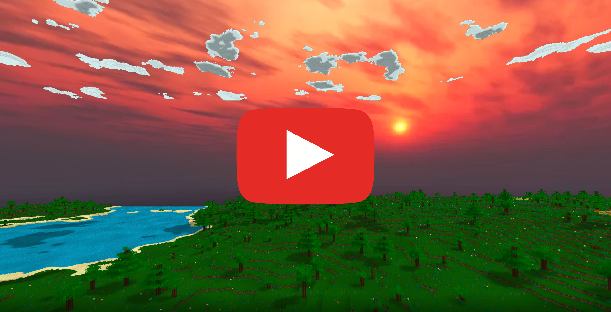

# 42-Vox

# Objective
```
This project aims to confront you to a graphic project that will be extremely demanding
in terms of optimization. You will have to study the characteristics of the voxel worlds,
and use them along your infographics knowledge to display a lot of elements on screen.
Thus, you will have to study different algo/opti to obtain a SMOOTH render (there are
many of them). You will also have to manage your memory and data structures properly
to be able to travel in a very, very large universe.
```
See [subject.pdf](en.subject.pdf).


# Requirement
- Go
- OpenGL 4


# Compatibility
Work on `Mac`, `Linux` and `Windows`. `Windows` will require `Golang 32bits` version.

# Usage
```
go run .
```
or
```
go build
./vox -fs=true
```

## Flags
```
-fs
    Set fullscreen mode (default true)
-maxVision float
	Set max cube vision (default 240)
-px float
	Starting X position (default 49272.25)
-py float
	Starting Y position (default 90)
-pz float
	Starting Z position (default 82937.15)
-seed float
	Seed used for procedural generation (default 42)
```

# How to "play"
- `asdw` to move
- `lctrl` and `space` to go up and down
- `mouse` to look around
- `lshift` to set speed at x20, `lalt` to set it at x50
- \` to show some stats (fps, number of triangles, positions, ...)
- `2` to change seed on live
- `3` to use Isometric View

# Video of the result
[](https://www.youtube.com/watch?v=OaGU2lnSlws)